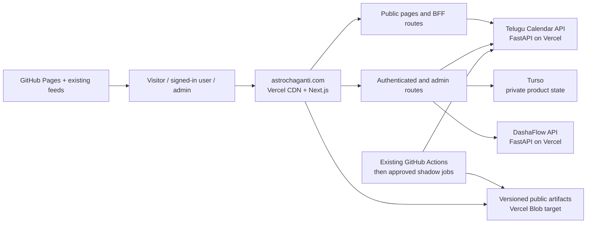

# Astro Chaganti — Architecture & Module Reference

<!-- last-updated: 2026-07-26 -->

> **Note:** The legacy "Basic / Professional" two-mode chart view was replaced
> with the unified dashboard on 2026-05-19. On 2026-07-26 the dashboard became
> a responsive profile workspace. Wide screens use a persistent grouped tool
> rail, while smaller screens use `Explore tools`; both are generated from one
> registry so future tools do not create another navigation system. Birth details,
> Panchang-at-birth, and D1/D9 charts live together in Natal chart. The
> components below
> describe the current architecture; legacy components (`ProfileDetailClient`,
> `ProfessionalView`, `DashaflowView`, `VargaDashboard`, `AntardashaTimeline`,
> `TransitView`, `CareerView`, `AIInsightShell`, `ProfileChat`, `LandingPage`,
> `ChartSkeleton`, `dashboard/ProfileList`) are deleted. If you see any of
> them referenced in code, check `git log` — they're gone from `main` after
> commit `297c665` (#52).

> **Companion to [`PROJECT.md`](./PROJECT.md)** — that file covers env vars,
> deployment gotchas, and the auth model. This file covers the code itself:
> every module's purpose, how the pieces connect, and the user journeys they
> serve.
>
> All file links point to `main` on GitHub:
> `https://github.com/socraticsurge/astro-unified-core`
>
> **Maintenance rule:** Update the `<!-- last-updated -->` stamp and the
> affected section(s) on every push that changes structure, routes, or journeys.
> See [`STANDARDS.md`](./STANDARDS.md) for the full documentation hygiene rules.

---

## Table of Contents

0. [User Types](#0-user-types)
1. [Server / Client Boundary Map](#1-server--client-boundary-map)
2. [Repository Layout](#2-repository-layout)
3. [Entry Points & Routing](#3-entry-points--routing)
4. [Authentication Layer](#4-authentication-layer)
5. [Database Layer](#5-database-layer)
6. [Astrology Engine Layer](#6-astrology-engine-layer)
7. [API Routes](#7-api-routes)
8. [Page Components](#8-page-components)
9. [Shared UI Components](#9-shared-ui-components)
10. [Content Library (Markdown CMS)](#10-content-library-markdown-cms)
11. [Utility Modules](#11-utility-modules)
12. [User Journey Traces](#12-user-journey-traces)
13. [Code Organisation Assessment](#13-code-organisation-assessment)
14. [Observability & Daily Landing Engine](#14-observability--daily-landing-engine)
15. [Unification Target Architecture](#15-unification-target-architecture)

---

## 0. User Types

<!-- last-updated: 2026-05-13 -->

Three personas access the app. Every feature decision and user journey should
be reasoned against all three.

### Guest (unauthenticated)
- Can access: `/` (current landing), `/unified` (Gate 6 staging experience),
  `/privacy`, `/terms`, `/credits`, `/robots.txt`, `/sitemap.xml`
- Cannot access: anything under `/dashboard`, `/profiles`, `/compatibility`, `/admin`
- All protected routes redirect to `/auth/signin` via [`proxy.ts`](https://github.com/socraticsurge/astro-unified-core/blob/main/proxy.ts) middleware

### Registered User
- Can access: full app — dashboard, profile CRUD, charts, compatibility
- Scoped to own data only: `db.profiles.list(userId)`, `db.compatibility.list(userId)`
- Limits: 10 profiles max, 6 compatibility checks max, rate-limited on refresh
- Cannot see: other users' profiles, admin panel, professional views

### Admin
- Defined by `ADMIN_EMAILS` env var (see [`lib/admin.ts`](https://github.com/socraticsurge/astro-unified-core/blob/main/lib/admin.ts))
- Can access: everything a Registered User can + admin panel at `/admin`
- Elevated data access: `db.profiles.getAny(id)`, `db.compatibility.getAny(id)`, `db.profiles.listAllWithUser()`
- Professional view toggle on all profile and compatibility detail pages
- Can trigger sidecar backfill (`/api/admin/backfill`) and clear compatibility history (`/api/admin/clear-compatibility`)

---

## 1. Server / Client Boundary Map

<!-- last-updated: 2026-05-14 -->

This is the most important section for anyone touching the codebase. Understanding
what runs where prevents the class of bugs where env vars are missing, `getServerSession`
returns null, or admin features silently disappear.

### The rule

**Server** = runs in a Node.js Lambda on Vercel. Has access to all env vars
(including secrets). Can call the DB, sidecar, and `getServerSession(authOptions)`.
Never runs in the browser.

**Client** = runs in the browser. Has NO access to server env vars.
`process.env.ADMIN_EMAILS` is `undefined`. `process.env.NEXTAUTH_SECRET` is `undefined`.
Must receive data via props, `useSession()`, or fetch calls to API routes.

### Page and layout components

| File | Runtime | Why |
|---|---|---|
| `app/layout.tsx` | Server | Root HTML shell, font loading, analytics |
| `app/page.tsx` | Server | Session check → redirect or LandingPage |
| `app/dashboard/page.tsx` | Server + `force-dynamic` | DB read (`db.profiles.list`) |
| `app/profiles/new/page.tsx` | Server | Static form shell |
| `app/profiles/[id]/page.tsx` | Server + `force-dynamic` | DB read (profile + sections) |
| `app/profiles/[id]/edit/page.tsx` | Server + `force-dynamic` | DB read (profile pre-fill) |
| `app/compatibility/page.tsx` | Server + `force-dynamic` | DB read (profiles + checks) |
| `app/compatibility/[id]/page.tsx` | Server + `force-dynamic` | DB read (check + profiles) |
| `app/admin/page.tsx` | Server + `force-dynamic` | Admin guard + all DB reads |
| `app/consultation/page.tsx` | Server + `force-dynamic` | DB read (pending request + settings) |
| `app/auth/signin/page.tsx` | Server | Static sign-in form |
| `app/privacy/page.tsx` | Server | Static |
| `app/terms/page.tsx` | Server | Static |
| `app/credits/page.tsx` | Server | Renders CREDITS.md |

### Client components (`"use client"`)

| File | Why client | What it cannot do |
|---|---|---|
| `app/dashboard/DashboardClient.tsx` | Active profile state, tab orchestration, parallel prefetch | Cannot call `isAdmin()` — reads `session.user.isAdmin` |
| `app/compatibility/[id]/CompatibilityDetailClient.tsx` | Interactive detail tabs | Same — reads `session.user.isAdmin` |
| `app/admin/AdminTables.tsx` | Tabs, sort, inline actions | Cannot call `isAdmin()` — admin gate is on the server page |
| `app/consultation/ConsultationForm.tsx` | Multi-step form with live preview | Receives settings as props from server |
| `components/NavBar.tsx` | `useSession`, `signOut`, profile chips, Ask button | Cannot call `isAdmin()` — reads `session.user.isAdmin` |
| `components/CosmicLanding.tsx` | Earth-globe video, theme-aware star canvas | Public landing |
| `components/AppShell.tsx`, `AppStarCanvas.tsx` | Persistent background canvas | |
| `components/compatibility/CompatibilityClient.tsx` | Profile selection, check submission | Receives profiles + checks as props |
| `components/profiles/ProfileView.tsx` + `components/unified/tabs/*` | Responsive profile workspace. `ProfileView` owns the grouped tool registry, active-tool state, persistent wide-screen rail, small-screen drawer, and relevant tool component. | Receives chart/transit/career output as props |
| `components/tabs/CompareTab.tsx`, `TodayTab.tsx` | Multi-profile compare + Today highlights | |
| `components/engines/MuhurthaView.tsx` | Event picker | |
| `components/engines/TarabalamView.tsx` | Exact multi-profile day comparison, Moon policy, evidence, and responsive results | |
| `components/panels/AskPanel.tsx`, `AIAdminPanel.tsx` | Public Ask panel + adaptive authenticated AI workspace | |
| `components/profiles/ProfileNav.tsx`, `ProfileChip.tsx`, `ProfileSidebar.tsx`, `ProfileView.tsx` | Profile switcher + grouped tool menus + on-demand profile editor | |
| `components/ProfileLoadingScreen.tsx` | Celestial loading screen after profile creation | |
| `components/ThemeProvider.tsx`, `ThemeToggle.tsx` | next-themes provider + toggle (Umbra / Vellum) | |
| `components/FeedbackWidget.tsx` | Floating overlay, form submit | |
| `components/ProfileForm.tsx` | Geocode-on-submit, controlled form | |
| `components/auth/NextAuthProvider.tsx` | `SessionProvider` mount | |

### API routes (all server-side, all in `app/api/`)

Every API route runs on the server. The client calls them via `fetch()`.
See [Section 7: API Routes](#7-api-routes) for the full route table.

### The `isAdmin` pattern

```
lib/auth.ts session callback (server)
  → evaluates ADMIN_EMAILS env var
  → stamps user.isAdmin = true/false into the JWT

lib/admin.ts isAdmin(session) (server-only)
  → called only in server components and API routes
  → NEVER in "use client" components

Client components (browser)
  → const showAdmin = (session?.user as { isAdmin?: boolean })?.isAdmin === true
  → reads the flag from the JWT, already evaluated server-side
```

If `isAdmin` is ever invisible to admin users after a code change, the
cause is almost always `isAdmin(session)` being called in a client component.

### What `process.env` is available where

| Variable | Server component | API route | Client component |
|---|---|---|---|
| `TURSO_DATABASE_URL` | Yes | Yes | No (never expose) |
| `TURSO_AUTH_TOKEN` | Yes | Yes | No (never expose) |
| `NEXTAUTH_SECRET` | Yes | Yes | No (never expose) |
| `ADMIN_EMAILS` | Yes | Yes | No (never expose) |
| `DASHAFLOW_SIDECAR_URL` | Yes | Yes | No |
| `GOOGLE_CLIENT_ID` | Yes | Yes | No |
| `NEXTAUTH_URL` | Yes | Yes | No |
| `NEXT_PUBLIC_SENTRY_DSN` | Yes | Yes | Yes (`NEXT_PUBLIC_` is bundled) |

---

## 2. Repository Layout

```
astrounified/
├── app/                    # Next.js App Router — pages, layouts, API routes
│   ├── api/                # Server-side API handlers
│   ├── admin/              # Admin-only panel
│   ├── auth/               # Sign-in page
│   ├── compatibility/      # Compatibility checker + detail views
│   ├── profiles/           # Profile CRUD + chart detail
│   ├── layout.tsx          # Root HTML shell
│   └── page.tsx            # Home — landing (guest) or redirect (auth)
├── components/             # React components
│   ├── engines/            # Chart/reading display components
│   ├── compatibility/      # Compatibility UI
│   ├── dashboard/          # Dashboard-specific components
│   ├── auth/               # Session provider wrapper
│   └── ui/                 # shadcn/ui primitives
├── content/                # 538 markdown files (Vedic interpretations)
│   ├── sections/           # Explainers for chart sections
│   ├── planet-in-house/    # Planet × house interpretations (110 files)
│   ├── house-lordship/     # House lord × house interpretations (146 files)
│   ├── dasha-pair/         # Mahadasha × antardasha pairs (83 files)
│   ├── conjunction/        # Planetary conjunctions (93 files)
│   ├── nakshatra/          # 27 lunar mansion interpretations
│   ├── ascendant/          # 12 rising-sign descriptions
│   ├── nabhasa-yoga/       # Special planetary yogas
│   └── lunar-yoga/         # Moon-based yogas
├── lib/                    # Shared server-side utilities
│   ├── engines/            # HTTP clients for the Python sidecar
│   ├── content/            # Markdown loader & renderer
│   └── *.ts                # Auth, DB, geocoding, astro helpers
├── public/                 # Static assets (icons, landing globe video)
├── docs/                   # Developer documentation (this file)
├── next.config.ts          # Next.js config
├── proxy.ts                # NextAuth middleware (route protection)
└── tailwind.config.mjs     # Tailwind v4 config
```

---

## 3. Entry Points & Routing

### Root Layout
[`app/layout.tsx`](https://github.com/socraticsurge/astro-unified-core/blob/main/app/layout.tsx)

Wraps every page. Provides:
- Google Fonts (`Inter` body, `Cormorant Garamond` headings)
- `NextAuthProvider` — makes the session available client-side
- `NavBar` — top navigation
- `FeedbackWidget` — floating feedback form overlay
- `@vercel/analytics` and `@vercel/speed-insights` scripts

### Home Page
[`app/page.tsx`](https://github.com/socraticsurge/astro-unified-core/blob/main/app/page.tsx)

Server component. If the user is authenticated, redirects to `/dashboard`.
Otherwise renders `LandingPage`. This is the only public non-auth page that
does a session check; all other public pages render without a session.

### Route Protection Middleware
[`proxy.ts`](https://github.com/socraticsurge/astro-unified-core/blob/main/proxy.ts)

NextAuth middleware (`export { auth as middleware }`). Runs on every request
before the page renders. Redirects unauthenticated users to `/auth/signin`
for all paths *except* the `PUBLIC_PATHS` set (`/`, `/privacy`, `/terms`).

### Navigation
[`components/NavBar.tsx`](https://github.com/socraticsurge/astro-unified-core/blob/main/components/NavBar.tsx)

Sticky top bar. Conditionally renders:
- **Dashboard** link (authenticated users)
- **Compatibility** link (authenticated users)
- **Admin** link (admin users only, gated by `isAdmin()`)
- Sign-in / Sign-out button (NextAuth)

---

## 4. Authentication Layer

### NextAuth Configuration
[`lib/auth.ts`](https://github.com/socraticsurge/astro-unified-core/blob/main/lib/auth.ts)

Central `authOptions` object used by every `getServerSession()` call:
- **Provider**: Google OAuth
- **Strategy**: JWT (no DB adapter — sessions live in a signed cookie)
- **`signIn` callback**: upserts the user row in Turso so admin can track logins
- **`session` callback**: adds `user.id = token.sub` (Google subject ID) to
  the session so API routes can scope queries by user

> **Important**: every server route must pass `authOptions` explicitly:
> `getServerSession(authOptions)` — without it, the callbacks don't run
> and `user.id` is `undefined`.

### Admin Guard
[`lib/admin.ts`](https://github.com/socraticsurge/astro-unified-core/blob/main/lib/admin.ts)

Exports `isAdmin(session)`. Reads a comma-separated `ADMIN_EMAILS` env var
(no hardcoded fallback). Used **server-side only** in:
- `app/admin/page.tsx` — gates the admin panel
- Every API route that needs to return data for *any* user (not just the caller)

`lib/auth.ts` session callback evaluates `ADMIN_EMAILS` server-side at sign-in
time and stamps `user.isAdmin = true/false` into the JWT. Client components
(`NavBar`, `ProfileDetailClient`, `CompatibilityDetailClient`) read
`session.user.isAdmin` from the JWT — they never call `isAdmin()` directly.
See [Section 1](#1-server--client-boundary-map) for the full pattern.

### Session Provider
[`components/auth/NextAuthProvider.tsx`](https://github.com/socraticsurge/astro-unified-core/blob/main/components/auth/NextAuthProvider.tsx)

Thin wrapper around NextAuth `SessionProvider`. Mounted in `app/layout.tsx`
so that client components can call `useSession()`.

### Sign-in Page
[`app/auth/signin/page.tsx`](https://github.com/socraticsurge/astro-unified-core/blob/main/app/auth/signin/page.tsx)

Custom sign-in page. Renders the "Sign in with Google" button that triggers
the NextAuth OAuth flow.

---

## 5. Database Layer

<!-- last-updated: 2026-05-13 -->

### Client & Schema
[`lib/db/`](https://github.com/socraticsurge/astro-unified-core/blob/main/lib/db/) — modular DB layer. `lib/db.ts` is a one-line re-export shim so all existing `import { db } from "@/lib/db"` imports continue to work.

| File | Responsibility |
|---|---|
| [`lib/db/client.ts`](https://github.com/socraticsurge/astro-unified-core/blob/main/lib/db/client.ts) | Turso client singleton, `ensureSchema()`, `SCHEMA_VERSION` |
| [`lib/db/users.ts`](https://github.com/socraticsurge/astro-unified-core/blob/main/lib/db/users.ts) | `User` type, `users.upsert`, `users.list` |
| [`lib/db/profiles.ts`](https://github.com/socraticsurge/astro-unified-core/blob/main/lib/db/profiles.ts) | `Profile`, `ProfileWithUser` types, full profiles CRUD |
| [`lib/db/readings.ts`](https://github.com/socraticsurge/astro-unified-core/blob/main/lib/db/readings.ts) | `Reading` type, cache save/fetch/delete |
| [`lib/db/compatibility.ts`](https://github.com/socraticsurge/astro-unified-core/blob/main/lib/db/compatibility.ts) | `CompatibilityCheck`, `CompatibilityCheckWithDetails` types, compatibility CRUD |
| [`lib/db/feedback.ts`](https://github.com/socraticsurge/astro-unified-core/blob/main/lib/db/feedback.ts) | `Feedback` type, feedback save/list |
| [`lib/db/settings.ts`](https://github.com/socraticsurge/astro-unified-core/blob/main/lib/db/settings.ts) | `AppSettings` type, `getAll()`, `set(key, value)` |
| [`lib/db/consultation-requests.ts`](https://github.com/socraticsurge/astro-unified-core/blob/main/lib/db/consultation-requests.ts) | `ConsultationRequest`, `ConsultationRequestWithUser` types; `getPending`, `listByUser`, `listAllWithUser`, `create`, `markAnswered` |
| [`lib/db/index.ts`](https://github.com/socraticsurge/astro-unified-core/blob/main/lib/db/index.ts) | Re-exports all types; assembles the `db` object |

Built on `@libsql/client` (Turso's HTTP SQLite driver).

**Tables:**

| Table | Purpose |
|---|---|
| `users` | One row per Google account (id = Google sub). Updated on every login. |
| `profiles` | Birth profiles. Belongs to a user. Contains geocoded lat/lon/timezone. |
| `readings` | Cache of sidecar responses. One row per `(profile_id, engine)`. |
| `compatibility_checks` | Results of Ashtakoota Milan runs. Stores full JSON payload. |
| `feedback` | User-submitted feedback/ratings. |
| `consultation_requests` | User questions (Life Problem Statements). One pending row per user at a time. |
| `settings` | Key-value app settings (e.g. `live_consultation_enabled`). Seeded with defaults. |
| `schema_version` | Single-row version table for schema migration tracking. |

**Schema management**: `ensureSchema()` runs lazily on the first DB call per
Lambda instance. It checks `schema_version`; if the stored version is behind
`SCHEMA_VERSION` (currently `7`), it runs all DDL statements. Column additions
use `ALTER TABLE … ADD COLUMN` wrapped in `try/catch` to handle re-runs.

**Key exported namespaces:**

```
db.users                — upsert, list
db.profiles             — list, listAll, listAllWithUser, get, getAny, create, update, delete
db.readings             — save, latestByEngine, deleteByProfile
db.compatibility        — list, listAllWithDetails, get, getAny, save
db.feedback             — save, list
db.settings             — getAll, set
db.consultationRequests — getPending, listByUser, listAllWithUser, create, markAnswered
```

### Rate Limiting
[`lib/rate-limit.ts`](https://github.com/socraticsurge/astro-unified-core/blob/main/lib/rate-limit.ts) — unified in-memory rate limiter: `rateLimit(key, limit, windowMs)` → `{ success, limit, remaining }`. Per-instance (not shared across Lambdas); adequate for abuse prevention on a small app.

> For global enforcement at scale, replace with Redis/Upstash.

---

## 6. Astrology Engine Layer

All computation-heavy work runs in the Python sidecar
([`socraticsurge/dashaflow-sidecar`](https://github.com/socraticsurge/dashaflow-sidecar), private).
The TypeScript layer is purely HTTP client + cache + TypeScript-native calculations.

### DashaFlow (Full Chart)
[`lib/engines/dashaflow.ts`](https://github.com/socraticsurge/astro-unified-core/blob/main/lib/engines/dashaflow.ts)

Calls `POST ${DASHAFLOW_SIDECAR_URL}/calculate` with birth coordinates.
Returns 17 chart sections (planets, dashas, yogas, ashtakavarga, etc.).
Consumed by `DashboardClient` and rendered across `components/unified/tabs/*`
(Chart, Planets, Houses, Dasha, Yogas, Jaimini, Ashtakavarga). Sidebar
navigation and Natal birth context come from the same payload; `ProfileSidebar`
is edit-only.

### Transit
[`lib/engines/transit.ts`](https://github.com/socraticsurge/astro-unified-core/blob/main/lib/engines/transit.ts)

Calls `POST ${DASHAFLOW_SIDECAR_URL}/transit` with birth data + a target date.
Returns current planetary positions (sign + degree within sign, not raw longitude).

> **Key gotcha**: the sidecar returns `{ sign: "Taurus", degree: 14.3 }` per
> planet — NOT a raw ecliptic longitude. To reconstruct longitude:
> `SIGNS.indexOf(sign) * 30 + degree`. Several parts of the codebase
> depend on this reconstruction.

### Career (D10 Analysis)
[`lib/engines/career.ts`](https://github.com/socraticsurge/astro-unified-core/blob/main/lib/engines/career.ts)

Calls `POST ${DASHAFLOW_SIDECAR_URL}/career` with birth data.
Returns D10 chart themes and planet-domain recommendations for career guidance.

### Tarabalam (canonical Telugu Calendar Utilities service)

The authenticated route
[`app/api/readings/tarabalam/route.ts`](https://github.com/socraticsurge/astro-unified-core/blob/main/app/api/readings/tarabalam/route.ts)
validates an owner-scoped request and delegates to
[`lib/panchangam/personal-search.ts`](https://github.com/socraticsurge/astro-unified-core/blob/main/lib/panchangam/personal-search.ts).
The adapter prepares anonymous derived contexts for one to four owned profiles
and calls Telugu Calendar Utilities `/v1/tarabalam`.

The service computes exact Drik daily Moon positions for 1–90 inclusive days.
It returns the day star and transition time, Tithi, each participant's Tara and
optional Chandrabalam house/verdict, plus an authoritative `good_for_all`
decision under the selected policy:

- `stars` — supportive Tara decides the shortlist; Moon-house context is shown.
- `puja_ok` — supportive Tara is required and Moon caution houses are excluded.
- `strict` — both supportive Tara and strong Chandrabalam are required.

Profile names and birth details remain in Astro Chaganti. The upstream service
receives only anonymous derived Nakshatra, Rasi, and Lagna context. The older
`lib/tarabalam.ts` helpers remain only for compatibility and historical tests;
they are not the authenticated calculation path.

### Astro Utilities
[`lib/astro-utils.ts`](https://github.com/socraticsurge/astro-unified-core/blob/main/lib/astro-utils.ts)

Shared constants and helpers:
- `SIGNS` — 12 sidereal sign names in order (Aries … Pisces)
- `NAKSHATRAS` — 27 nakshatra names
- `longitudeToSign(lon)` — `SIGNS[Math.floor(lon / 30) % 12]`
- `longitudeToNakshatra(lon)` — `NAKSHATRAS[Math.floor(lon / (360/27)) % 27]`
- `parseVedAstroPlanets(data)` — normalises sidecar planet output into a
  consistent `{ sign, degree, house, nakshatra, dignity }` shape
- `dignityBadgeColor(dignity)` — Tailwind colour class for exaltation/debilitation

### Engine Error Handling
[`lib/engine-error.ts`](https://github.com/socraticsurge/astro-unified-core/blob/main/lib/engine-error.ts)

`extractEngineError(response)` — detects failure payloads in sidecar responses
(checks `.error`, `.errors`, `.data === null`). Used in all reading routes to
surface a human-readable error instead of rendering broken data.

---

## 7. API Routes

All routes authenticate via `getServerSession(authOptions)` and return JSON.
Admin routes additionally check `isAdmin(session)`.

### Profile Management

**[`app/api/profiles/route.ts`](https://github.com/socraticsurge/astro-unified-core/blob/main/app/api/profiles/route.ts)**

- `GET` — returns the caller's profiles (`db.profiles.list(userId)`)
- `POST` — creates a new profile:
  1. Rate-limit check (5 req/min per user email)
  2. Profile cap check (max 10 per user)
  3. `geocodePlace(place)` → lat, lon, IANA timezone, offset
  4. `db.profiles.create(userId, data)`

**[`app/api/profiles/[id]/route.ts`](https://github.com/socraticsurge/astro-unified-core/blob/main/app/api/profiles/%5Bid%5D/route.ts)**

- `GET` — fetches one profile (admin can fetch any user's profile)
- `PUT` — updates a profile (re-geocodes if place changed)
- `DELETE` — deletes a profile + cascades by calling `db.readings.deleteByProfile`

### Astrology Readings

**[`app/api/readings/dashaflow/route.ts`](https://github.com/socraticsurge/astro-unified-core/blob/main/app/api/readings/dashaflow/route.ts)**

- `GET` — returns latest cached chart for a profile (admin can fetch any profile's cache)
- `POST` — triggers a fresh calculation:
  1. Load profile from DB
  2. Call `fetchDashaflow(profile)` → full chart JSON
  3. `db.readings.save(profile_id, "dashaflow", input, output)`
  4. Return chart data

**[`app/api/readings/transit/route.ts`](https://github.com/socraticsurge/astro-unified-core/blob/main/app/api/readings/transit/route.ts)**

- `POST` — transit positions for a profile on a given date
  - Calls `fetchTransit(profile, date)` — result is not cached (ephemeral)

**[`app/api/readings/career/route.ts`](https://github.com/socraticsurge/astro-unified-core/blob/main/app/api/readings/career/route.ts)**

- `POST` — D10 career analysis
  - Rate-limited separately via `lib/security.ts`
  - Calls `fetchCareer(profile)` → D10 themes + planet recommendations
  - Cached in readings table under engine `"career"`

**[`app/api/readings/muhurtha/route.ts`](https://github.com/socraticsurge/astro-unified-core/blob/main/app/api/readings/muhurtha/route.ts)**

- `POST` — auspicious timing check for an event type + date/time/location

**[`app/api/readings/tarabalam/route.ts`](https://github.com/socraticsurge/astro-unified-core/blob/main/app/api/readings/tarabalam/route.ts)**

- `POST` — Tara + Tithi calendar for one or more profiles over a date range:
  1. Load each profile from DB
  2. Extract birth nakshatra from the cached dashaflow reading
  3. Call `fetchTransit()` *once* for today → reconstruct Moon & Sun longitudes
  4. Extrapolate Moon/Sun position for each day in the range
  5. Compute `computeTara()` and `computeTithi()` per profile per day
  6. Return structured grid

### Compatibility

**[`app/api/compatibility/route.ts`](https://github.com/socraticsurge/astro-unified-core/blob/main/app/api/compatibility/route.ts)**

- `GET` — list user's compatibility checks (most recent first)
- `POST` — run a new check:
  1. Load both profiles from DB (verifies ownership)
  2. Check limit (6 checks per user)
  3. `POST ${DASHAFLOW_SIDECAR_URL}/compatibility` with both profiles' birth data
  4. `db.compatibility.save(userId, { profile_id_1, profile_id_2, score, result_json })`
  5. Return saved check record

### Content

**[`app/api/content/[type]/[key]/route.ts`](https://github.com/socraticsurge/astro-unified-core/blob/main/app/api/content/%5Btype%5D/%5Bkey%5D/route.ts)**

Lazy-loads interpretive markdown for a specific content type + key
(e.g. `planet-in-house/Sun-in-House1`). Called on demand from the chart view
when a user expands an explainer modal. Content is cached in memory by
`lib/content/loader.ts` after first load.

### Feedback

**[`app/api/feedback/route.ts`](https://github.com/socraticsurge/astro-unified-core/blob/main/app/api/feedback/route.ts)**

- `POST` — saves a user feedback entry (rating + optional message + page URL)

### Admin

**[`app/api/admin/backfill/route.ts`](https://github.com/socraticsurge/astro-unified-core/blob/main/app/api/admin/backfill/route.ts)**

Admin-only. Re-runs DashaFlow for all profiles in the DB and updates their
cached readings. Used when the sidecar is updated and stale caches need refreshing.

**[`app/api/admin/clear-compatibility/route.ts`](https://github.com/socraticsurge/astro-unified-core/blob/main/app/api/admin/clear-compatibility/route.ts)**

Admin-only. Deletes all rows from `compatibility_checks`. Exposed in the admin
UI as the "Clear History" button.

**[`app/api/admin/consultation-requests/route.ts`](https://github.com/socraticsurge/astro-unified-core/blob/main/app/api/admin/consultation-requests/route.ts)**

Admin-only. `PATCH ?id=<id>` marks a consultation request as answered and saves an optional admin note.

**[`app/api/admin/settings/route.ts`](https://github.com/socraticsurge/astro-unified-core/blob/main/app/api/admin/settings/route.ts)**

Admin-only. `GET` returns all app settings. `PATCH` updates one or more settings (boolean values only).

### Consultation Requests

**[`app/api/consultation-requests/route.ts`](https://github.com/socraticsurge/astro-unified-core/blob/main/app/api/consultation-requests/route.ts)**

- `GET` — returns the authenticated user's consultation request history.
- `POST` — submits a new consultation request. Enforces one-pending-at-a-time. Rate-limited 5/min.
  Validates all three Life Problem Statement fields meet `MIN_FIELD_LENGTH = 30`.

---

## 8. Page Components

### Dashboard
**[`app/dashboard/page.tsx`](https://github.com/socraticsurge/astro-unified-core/blob/main/app/dashboard/page.tsx)**

Server component. Fetches `db.profiles.list(userId)` and renders
`ProfileList` with a "New Profile" button. Shows profile count vs 10-profile
limit.

### Profile Creation & Editing

**[`app/profiles/new/page.tsx`](https://github.com/socraticsurge/astro-unified-core/blob/main/app/profiles/new/page.tsx)**

Renders `ProfileForm` in create mode. On submit POSTs to `/api/profiles`.

**[`app/profiles/[id]/edit/page.tsx`](https://github.com/socraticsurge/astro-unified-core/blob/main/app/profiles/%5Bid%5D/edit/page.tsx)**

Server component. Fetches the profile, renders `ProfileForm` pre-populated
with existing data in edit mode. On submit PUTs to `/api/profiles/[id]`.

**[`components/ProfileForm.tsx`](https://github.com/socraticsurge/astro-unified-core/blob/main/components/ProfileForm.tsx)**

Reusable form for both create and edit flows. Fields: name, DOB, time of birth,
place of birth (geocoded on submit), current location (optional), gender,
relationship label.

### Dashboard / Profile View

**[`app/profiles/[id]/page.tsx`](https://github.com/socraticsurge/astro-unified-core/blob/main/app/profiles/%5Bid%5D/page.tsx)**

Server component. Auth-gated. Redirects to `/dashboard?profile={id}` — the
unified dashboard is now the single entry point for viewing any profile.
The legacy `ProfileDetailClient` (and its Basic / Professional toggle) was
removed in the 2026-05-19 cleanup.

**[`app/dashboard/page.tsx`](https://github.com/socraticsurge/astro-unified-core/blob/main/app/dashboard/page.tsx)**

Server component. Auth-gated. Resolves the active profile from the
`?profile={id}` query param (defaulting to the user's first profile),
loads all of the user's profiles for the NavBar pill switcher, and renders
`DashboardClient`.

**[`app/dashboard/DashboardClient.tsx`](https://github.com/socraticsurge/astro-unified-core/blob/main/app/dashboard/DashboardClient.tsx)**

Client component. Owns the active-profile state and orchestrates engine
fetches for the entire dashboard. Renders `NavBar` + `ProfileView`;
`ProfileSidebar` mounts only as an on-demand profile editor.

- **New profile flow** (`?new=1`): shows `ProfileLoadingScreen` while
  chart, transit, career, and today-reading load in parallel. Minimum 1.4s
  animation; lifts when the chart is ready while optional engines continue
  loading in their own panels.
- **Returning user flow**: chart + transit prefetched immediately;
  today-reading chains after chart resolves; career loads lazily on tab
  open. Toggling between profile pills is served from the in-memory
  per-profile cache (no refetch unless the user explicitly triggers refresh).
- **Optional narrative failure**: an unavailable LLM provider does not hide
  deterministic chart, dasha, or transit content. Today and Natal surface a
  retryable unavailable state, while the API records the provider exception
  without returning raw provider or environment details to the browser.

**[`components/profiles/ProfileView.tsx`](https://github.com/socraticsurge/astro-unified-core/blob/main/components/profiles/ProfileView.tsx)**

Hosts the responsive profile workspace. Wide screens use a persistent,
vertically scrollable grouped tool rail; smaller screens use one `Explore tools`
button that opens the same registry in a drawer. This avoids horizontal clipping
and competing navigation models as tools are added. The rail begins with static
active-profile identity and an explicit Edit profile action. Natal chart owns birth data,
Panchang-at-birth, and D1/D9 charts; `ProfileSidebar` is now an on-demand editor,
not a competing information surface. The governing interaction and release
criteria live in
[`docs/DASHBOARD_EXPERIENCE_PRINCIPLES.md`](DASHBOARD_EXPERIENCE_PRINCIPLES.md).

| Group | Tools | Visibility |
|---|---|---|
| Overview | Today | User + admin |
| Birth chart | Natal chart, Planets, Divisional charts | Divisional is admin-only |
| Timing & decisions | Dashas, Transits, Muhurtam, Tarabalam | User + admin |
| Specialist analysis | Yogas, Jaimini, Ashtakavarga, Shadbala | Admin-only |
| Life areas | Career | User + admin |
| Relationships | Marriage compatibility | User + admin |

`CHART_TABS` is the single registry for labels, descriptions, icons, visibility,
and component IDs. `CHART_GROUPS` controls information architecture. To add a
future tool, add one registry entry, place its ID in a group (or add a group),
and add its panel renderer. Both desktop and mobile navigation update from those
same arrays; do not introduce another horizontal tab strip.

`TodayTab` is intentionally a decision-oriented overview rather than a data
dump. It presents active priorities, a three-level current-period summary,
an explicit entry into the D1/D9 natal charts, quick actions into
Muhurtam/Tarabalam/Compatibility, and the optional personal narrative. The full
five-level Dasha tree remains in `DashaTab`.

All signed-in users can open **Explore with AI**
(`components/panels/AIAdminPanel`) with the active profile and section context;
admins additionally receive the summary/model controls. The separate **Ask
panel** (`components/panels/AskPanel`) triggers a human consultation request
from any tab.

### Compatibility

Marriage compatibility is part of the active profile workspace rather than a
separate page. `ProfileView` owns the selected partner and returned check state;
[`components/tabs/CompareTab.tsx`](https://github.com/socraticsurge/astro-unified-core/blob/main/components/tabs/CompareTab.tsx)
renders the complete journey.

The current profile is fixed. The tab filters eligible saved profiles by the
traditional groom/bride role used by the sidecar, requires an explicit
Calculate action, then calls `POST /api/compatibility`. A saved check loaded
through `/dashboard?compare={id}` opens the same result without recalculation.

The result presents, in order:

- the exact classical score out of 36 and the customary 18-point reference;
- all eight Koota points and maxima;
- both Moon profiles (sign, Nakshatra, Gana, Nadi, and Yoni);
- Mangal/Kuja balance and Bhakoot status;
- exact Kuja contributors;
- all additional Kutas and returned descriptions;
- returned exceptions and an explicit decision boundary.

`POST /api/compatibility` authenticates and rate-limits the caller, rejects
missing or identical profile IDs, scopes both profiles to the caller for
non-admin users, preserves the six-check cap, returns an existing duplicate,
and only then calls DashaFlow. Results remain stored in Turso under the
authenticated user.
- Dosha Mitigations — classical exception strings from BPHS

### Admin Panel

**[`app/admin/page.tsx`](https://github.com/socraticsurge/astro-unified-core/blob/main/app/admin/page.tsx)**

Server component. Admin-gated. Loads users, profiles (with user email join),
compatibility checks (with profile name join), feedback, all consultation requests,
and app settings. Renders `AdminTables`.

**[`app/admin/AdminTables.tsx`](https://github.com/socraticsurge/astro-unified-core/blob/main/app/admin/AdminTables.tsx)**

Client component. Six tabs:
- **Users** — sign-in history, emails
- **Profiles** — all profiles across users with birth data
- **Compatibility** — all checks with **View** link (→ `/compatibility/[id]`) and JSON dropdown
- **Feedback** — submitted ratings and messages
- **Questions** — consultation requests; pending cards show the assembled question and a "Mark as Answered" action with optional admin note
- **Settings** — toggle switch for `live_consultation_enabled`

### Consultation

**[`app/consultation/page.tsx`](https://github.com/socraticsurge/astro-unified-core/blob/main/app/consultation/page.tsx)**

Server component. Auth-gated (middleware). Loads: pending consultation request, user's profiles, app settings. Renders `ConsultationForm`.

**[`app/consultation/ConsultationForm.tsx`](https://github.com/socraticsurge/astro-unified-core/blob/main/app/consultation/ConsultationForm.tsx)**

Client component. Steps:
1. Select one of 8 life areas (Career, Wealth, Marriage, Family, Health, Education, Travel, Dharma)
2. Select one or more profiles the question is about
3. Fill the three Life Problem Statement fields (Observation / Constraint / Objective) — live char count, per-area placeholder examples
4. Live assembled preview panel
5. Delivery mode: Written Answer (always shown) | Live Consultation (shown only when `live_consultation_enabled = true`)

When a pending question exists, renders `PendingCard` instead of the form — shows the submitted question and admin note if present.

---

## 9. Shared UI Components

### Chart Engine Components

The chart UI is split across two directories:

**[`components/unified/`](https://github.com/socraticsurge/astro-unified-core/blob/main/components/unified/)** — chart-analysis tools rendered inside `ProfileView`:

| Component | What it renders |
|---|---|
| [`TabGrid.tsx`](https://github.com/socraticsurge/astro-unified-core/blob/main/components/unified/TabGrid.tsx) | Shared `TwoColumnTabGrid` / `TabColumn` / `TabSection` primitives — composed by every dense tab |
| [`TabLoadingSkeleton.tsx`](https://github.com/socraticsurge/astro-unified-core/blob/main/components/unified/TabLoadingSkeleton.tsx) | Shared pulsing loader (transit, career, etc.) |
| [`IdentityStrip.tsx`](https://github.com/socraticsurge/astro-unified-core/blob/main/components/unified/IdentityStrip.tsx) | Ascendant / Moon sign / Nakshatra strip |
| [`HouseGrid.tsx`](https://github.com/socraticsurge/astro-unified-core/blob/main/components/unified/HouseGrid.tsx) | 12-house diamond/grid |
| [`NatalChartGrid.tsx`](https://github.com/socraticsurge/astro-unified-core/blob/main/components/unified/NatalChartGrid.tsx) | Square North-Indian style chart |
| [`SavChartGrid.tsx`](https://github.com/socraticsurge/astro-unified-core/blob/main/components/unified/SavChartGrid.tsx) | SAV (sarvashtakavarga) chart |
| [`tabs/ChartTab.tsx`](https://github.com/socraticsurge/astro-unified-core/blob/main/components/unified/tabs/ChartTab.tsx) | Main chart visualization |
| [`tabs/PlanetsTab.tsx`](https://github.com/socraticsurge/astro-unified-core/blob/main/components/unified/tabs/PlanetsTab.tsx) | Planet table — sign, house, retro, dignity, shadbala |
| [`tabs/HousesVargasTab.tsx`](https://github.com/socraticsurge/astro-unified-core/blob/main/components/unified/tabs/HousesVargasTab.tsx) | D1 + D-chart switcher |
| [`tabs/DashaTab.tsx`](https://github.com/socraticsurge/astro-unified-core/blob/main/components/unified/tabs/DashaTab.tsx) | 5-level Vimshottari with timeline visualization |
| [`tabs/timeline/DashaTimeline.tsx`](https://github.com/socraticsurge/astro-unified-core/blob/main/components/unified/tabs/timeline/DashaTimeline.tsx) + [`DashaRow.tsx`](https://github.com/socraticsurge/astro-unified-core/blob/main/components/unified/tabs/timeline/DashaRow.tsx) | Visual dasha row |
| [`tabs/YogasTab.tsx`](https://github.com/socraticsurge/astro-unified-core/blob/main/components/unified/tabs/YogasTab.tsx) | Engine-returned major and supporting yogas, forming planets, and context-separated Dosha/junction conditions |
| [`tabs/JaiminiTab.tsx`](https://github.com/socraticsurge/astro-unified-core/blob/main/components/unified/tabs/JaiminiTab.tsx) | Engine-returned Atmakaraka/Karakamsha orientation, ordered Chara Karakas, complete Arudha Padas, and contextual Upapada |
| [`tabs/AshtakavargaTab.tsx`](https://github.com/socraticsurge/astro-unified-core/blob/main/components/unified/tabs/AshtakavargaTab.tsx) | Lagna-mapped SAV house support, D1 chart context, and exact seven-planet BAV contributions |
| [`tabs/ShadabalaTab.tsx`](https://github.com/socraticsurge/astro-unified-core/blob/main/components/unified/tabs/ShadabalaTab.tsx) | Total-versus-required Rupas, exact six-part Virupa evidence, paired Ishta/Kashta Phala, and secondary Bhava Chalit shifts |
| [`tabs/TimeTab.tsx`](https://github.com/socraticsurge/astro-unified-core/blob/main/components/unified/tabs/TimeTab.tsx) | Panchang + birth time details |
| [`tabs/TransitsTab.tsx`](https://github.com/socraticsurge/astro-unified-core/blob/main/components/unified/tabs/TransitsTab.tsx) | Compact card grid; calls `POST /api/readings/transit` |
| [`tabs/CareerTab.tsx`](https://github.com/socraticsurge/astro-unified-core/blob/main/components/unified/tabs/CareerTab.tsx) | 10th-house foundation, complete D10 indicator map, exact supportive/complicating engine evidence, and unranked career domains; calls `/api/readings/career` |

**[`components/tabs/`](https://github.com/socraticsurge/astro-unified-core/blob/main/components/tabs/)** — top-level tabs that compose multiple data sources:

| Component | What it renders |
|---|---|
| [`TodayTab.tsx`](https://github.com/socraticsurge/astro-unified-core/blob/main/components/tabs/TodayTab.tsx) + [`TodayInsightCard.tsx`](https://github.com/socraticsurge/astro-unified-core/blob/main/components/tabs/TodayInsightCard.tsx) | Personal overview, active priorities, three-level current-period summary, quick actions, optional LLM narrative |
| [`CompareTab.tsx`](https://github.com/socraticsurge/astro-unified-core/blob/main/components/tabs/CompareTab.tsx) | Inline Ashtakoota compatibility for sibling profiles |

**[`components/engines/`](https://github.com/socraticsurge/astro-unified-core/blob/main/components/engines/)** — reusable engine views embedded in the profile workspace:

| Component | What it renders |
|---|---|
| [`MuhurthaView.tsx`](https://github.com/socraticsurge/astro-unified-core/blob/main/components/engines/MuhurthaView.tsx) | Auspicious timing for event types (marriage, travel, etc.) |
| [`TarabalamView.tsx`](https://github.com/socraticsurge/astro-unified-core/blob/main/components/engines/TarabalamView.tsx) | Exact day shortlist, multi-profile Tara and Chandrabalam reasoning, evidence, and sharing |
| [`SectionShell.tsx`](https://github.com/socraticsurge/astro-unified-core/blob/main/components/engines/SectionShell.tsx) | Collapsible section container with ⓘ trigger |
| [`ExplainerModal.tsx`](https://github.com/socraticsurge/astro-unified-core/blob/main/components/engines/ExplainerModal.tsx) | Tabbed modal: "For your chart" + "About" |
| [`AIInsightCard.tsx`](https://github.com/socraticsurge/astro-unified-core/blob/main/components/engines/AIInsightCard.tsx) | LLM compatibility / chart insights card |
| [`CompatibilityChat.tsx`](https://github.com/socraticsurge/astro-unified-core/blob/main/components/engines/CompatibilityChat.tsx) | Chat overlay on compatibility detail |
| [`SectionShell.tsx`](https://github.com/socraticsurge/astro-unified-core/blob/main/components/engines/SectionShell.tsx) | Collapsible section wrapper with ⓘ explainer trigger |
| [`ExplainerModal.tsx`](https://github.com/socraticsurge/astro-unified-core/blob/main/components/engines/ExplainerModal.tsx) | "For your chart" + "About" tabbed modal |

### Landing & Feedback
[`components/LandingPage.tsx`](https://github.com/socraticsurge/astro-unified-core/blob/main/components/LandingPage.tsx) — Hero + four service area sections (Relationships, Career, Timing, Family) with CTAs

[`components/FeedbackWidget.tsx`](https://github.com/socraticsurge/astro-unified-core/blob/main/components/FeedbackWidget.tsx) — Floating overlay: emoji rating + optional message, submits to `/api/feedback`

### shadcn/ui Primitives
[`components/ui/`](https://github.com/socraticsurge/astro-unified-core/blob/main/components/ui/)

Standard shadcn components: `button`, `badge`, `card`, `input`, `label`,
`separator`, `tabs`, `scroll-area`. Styled with `class-variance-authority`
and Tailwind.

---

## 10. Content Library (Markdown CMS)

### Loader & Renderer
[`lib/content/loader.ts`](https://github.com/socraticsurge/astro-unified-core/blob/main/lib/content/loader.ts) — Reads and caches markdown files by type + key. Uses `gray-matter` for YAML frontmatter.

[`lib/content/lookup.ts`](https://github.com/socraticsurge/astro-unified-core/blob/main/lib/content/lookup.ts) — Convenience helpers to look up content by chart data (e.g. `lookupPlanetInHouse("Sun", 1)`).

[`lib/content/markdown.ts`](https://github.com/socraticsurge/astro-unified-core/blob/main/lib/content/markdown.ts) — `marked` wrapper + a "two-track" body splitter that separates the
personalised chart interpretation from the generic educational text.

[`lib/content/types.ts`](https://github.com/socraticsurge/astro-unified-core/blob/main/lib/content/types.ts) — TypeScript types for all content shapes (`SectionEntry`, `PlanetInHouseEntry`, `DashaPairEntry`, etc.).

### Content Volumes

| Directory | Type | Count | Keys |
|---|---|---|---|
| `content/sections/` | Chart section explainers | ~20 | `vimshottari-dasha`, `yogas`, `transit-analysis`, etc. |
| `content/planet-in-house/` | Planet × house | ~110 | `Sun-in-House1` … `Ketu-in-House12` |
| `content/house-lordship/` | Lord × house | ~146 | `1st-lord-in-1st` … `12th-lord-in-12th` |
| `content/dasha-pair/` | Mahadasha + antardasha | ~83 | `Sun-Sun` … `Ketu-Ketu` |
| `content/conjunction/` | Planet pairs | ~93 | `Sun-Moon` … `Rahu-Ketu` |
| `content/nakshatra/` | Lunar mansions | 27 | `Ashwini` … `Revati` |
| `content/ascendant/` | Rising signs | 12 | `Aries` … `Pisces` |
| `content/nabhasa-yoga/` | Special yogas | ~26 | `Chakra`, `Yava`, etc. |
| `content/lunar-yoga/` | Moon yogas | ~26 | `Gaja-Kesari`, etc. |

Each file has YAML frontmatter (`type`, `title`, `factors`, `sources`,
`rendering_status`) and a markdown body with two tracks: a personalised
interpretation (uses chart-specific facts) and a generic educational section.

---

## 11. Utility Modules

| Module | Purpose |
|---|---|
| [`lib/geocode.ts`](https://github.com/socraticsurge/astro-unified-core/blob/main/lib/geocode.ts) | `geocodePlace(text)` → calls Nominatim, resolves IANA timezone via `geo-tz` |
| [`lib/utils.ts`](https://github.com/socraticsurge/astro-unified-core/blob/main/lib/utils.ts) | `cn(...classes)` — `clsx` + `tailwind-merge` |
| [`lib/chart-summary.ts`](https://github.com/socraticsurge/astro-unified-core/blob/main/lib/chart-summary.ts) | Generates a plain-text summary of chart data for clipboard or LLM consumption |
| [`lib/sanitize.ts`](https://github.com/socraticsurge/astro-unified-core/blob/main/lib/sanitize.ts) | Dual client/server HTML sanitizer to prevent XSS in `dangerouslySetInnerHTML` |

---

## 12. User Journey Traces

### Journey 1: New User Sign-In

```
User visits https://astro-unified-core-pfni.vercel.app/
  → app/page.tsx              — no session, renders LandingPage
  → "Get Started" CTA click
  → app/auth/signin/page.tsx  — "Sign in with Google" button
  → NextAuth OAuth flow
  → lib/auth.ts signIn()      — db.users.upsert(googleUser)
  → redirect to /dashboard
  → app/dashboard/page.tsx    — "No profiles yet" empty state
```

### Journey 2: Creating a Birth Profile

```
/dashboard → "New Profile" →
  app/profiles/new/page.tsx
    → components/ProfileForm.tsx (name, DOB, time, place, gender, relationship)
    → submit → POST /api/profiles
      → app/api/profiles/route.ts
        → rate limit check (lib/rate-limit.ts)
        → geocodePlace(place) → lib/geocode.ts → Nominatim + geo-tz
        → db.profiles.create(userId, data)
        → 201 + profile JSON
  → redirect to /profiles/{id}
```

### Journey 3: Viewing a Birth Chart

```
/profiles/{id}                  ← legacy URL; redirects to /dashboard?profile={id}
/dashboard?profile={id} →
  app/dashboard/page.tsx (server)
    → db.profiles.list(userId)              ← user's own profiles for NavBar pills
    → resolve active profile from ?profile= or default to first
    → renders DashboardClient(profiles, initialProfileId, isNewProfile, isAdmin)

  DashboardClient (client)
    → Returning-user flow (default):
      ╠ Check profileCacheRef.get(activeProfileId)
      ║   cache hit → hydrate from { chart, transit, career, todayReading }
      ║   cache miss → run the fetches below
      ║
      ╠ Chart (parallel):
      ║   GET /api/readings/dashaflow?profile_id={id}
      ║     → db.readings.latestByEngine(id, "dashaflow")
      ║     → cache hit → return stored chart JSON
      ║     → cache miss → fetchDashaflow(profile) → sidecar /calculate → save → return
      ║   (after chart resolves) GET /api/readings/today-reading
      ║     → checks input_snapshot { birth_data, pratyantar_end, llm_fingerprint }
      ║     → fingerprint mismatch (admin edited prompt / temperature) → regenerate
      ║
      ╠ Transit (parallel):
      ║   GET /api/readings/transit?profile_id={id} → sidecar /transit
      ║
      ╚ Career: lazy — fired only when the user opens the Career tab
        GET /api/readings/career?profile_id={id} → sidecar /career

    → New-profile flow (?new=1):
      → ProfileLoadingScreen mounted (orbital animation, min 2s)
      → All four fetches (chart, transit, career, today-reading) fire in parallel
      → Loading screen dismisses when min-time AND all-settled both true

  ProfileView (client, inside DashboardClient)
    → Builds persistent grouped rail and small-screen drawer from one registry
    → Renders the active workspace tool:
        Overview             → TodayTab + TodayInsightCard
        Birth chart          → NatalTab / PlanetsTab / admin Divisional charts
        Timing & decisions   → DashaTab / TransitsTab / MuhurthaView / TarabalamView
        Specialist analysis → admin Yogas / Jaimini / Ashtakavarga / Shadbala
        Life areas           → CareerTab (triggers fetchCareer on open)
        Relationships        → CompareTab

    → Admin only:
      → AIAdminPanel slide-out for inspecting/chatting with LLM output
      → AI button on each tab triggers handleAIOpen with tab context

    → Per-tab Ask button → AskPanel → POST /api/consultation-requests
```

Muhurtha and Tarabalam are first-class tools inside the profile workspace.
Their public counterparts remain available without sign-in; the authenticated
views add selected-profile validation.

### Journey 4: Running a Compatibility Check

```
/compatibility →
  app/compatibility/page.tsx (server)
    → db.profiles.list(userId)               ← user's own profiles for dropdowns
    → db.compatibility.list(userId)          ← existing checks
    → renders CompatibilityClient

  CompatibilityClient (client)
    → Select male profile (gender=male filtered)
    → Select female profile (gender=female filtered)
    → "Run Check" → POST /api/compatibility
        → app/api/compatibility/route.ts
          → load both profiles, verify ownership
          → check 6-check limit
          → POST sidecar /compatibility
          → db.compatibility.save(userId, { ... , result_json })
          → router.push('/compatibility/{id}')

  /compatibility/{id} →
  app/compatibility/[id]/page.tsx (server)
    → db.compatibility.get(id, userId) or getAny(id)
    → db.profiles.getAny(profile_id_1), db.profiles.getAny(profile_id_2)
    → renders CompatibilityDetailClient

  CompatibilityDetailClient (client)
    → Basic view: score ring, 8-koota table, Mangal + Bhakoot dosha cards
    → Professional view (admin): natal moon profiles, kuja breakdown,
      additional kutas, dosha mitigations
```

### Journey 5: Admin Reviewing Users

```
/admin →
  app/admin/page.tsx (server)
    → isAdmin(session) check → redirect if not admin
    → db.users.list()
    → db.profiles.listAllWithUser()
    → db.compatibility.listAllWithDetails()
    → db.feedback.list()
    → renders AdminTables

  AdminTables
    → Users tab: login history
    → Profiles tab: all profiles across all users
    → Compatibility tab:
        "View" link → /compatibility/{id}     ← standard detail page
        "JSON" dropdown → raw result_json
    → Feedback tab: ratings + messages

  Clicking "View" on a compatibility check:
    → /compatibility/{id} (same journey as above)
    → Admin sees Professional view toggle because isAdmin(session) = true
```

### Journey 6: Tarabalam for a Family

```
/dashboard?profile={id} → Timing & decisions → Tarabalam →
  TarabalamView
    → Active profile is always included and anchors the current location
    → Add up to three other owned profiles
    → Choose 1–90 inclusive days and a Chandrabalam policy
    → "Find supportive days" →
      POST /api/readings/tarabalam {
        profile_ids, start_date, end_date, chandra_mode
      }
        → Validate auth, rate limit, range, and unique profile ownership
        → Derive anonymous Nakshatra/Rasi/Lagna contexts from saved charts
        → POST Telugu Calendar Utilities /v1/tarabalam
        → Preserve canonical daily `good_for_all` decisions
        → Reattach owner-visible profile labels in the BFF response

    → Shortlist metrics and supportive date links
    → Responsive comparison table: date + star transition + Tithi +
      overall verdict + one Tara/Chandra column per selected person
    → Evidence boundary + WhatsApp share + explicit long-result expansion
```

---

## 13. Code Organisation Assessment

### What Works Well

**Clear separation of concerns.** The `lib/engines/` pattern keeps all
sidecar HTTP clients in one place, with a consistent call signature. Adding a
new sidecar endpoint means adding one file in `lib/engines/` and one API route
— nothing else changes.

**Server / client split is disciplined.** Pages follow the App Router pattern
correctly: server components fetch data and pass it as props; client components
handle interactivity. No data-fetching in client components except for
user-triggered actions.

**Content at scale.** 538 markdown files with a typed loader and lazy
per-key API fetching means the content library can grow without impacting
initial page load. Only the section explainers are pre-loaded at the server
component level (good trade-off for LCP).

**DB schema simplicity.** Using `schema_version` + `ensureSchema()` with
`ALTER TABLE … ADD COLUMN` in `try/catch` is lightweight and reliable for a
small team — no migration runner required.

**Canonical Tarabalam boundary.** The browser does no date extrapolation or
group reclassification. One bounded BFF call receives exact service results,
keeps private profile identity local, and preserves the engine's authoritative
policy verdict.

### Resolved (2026-05-13)

- ~~Two rate-limiter modules~~ — `lib/security.ts` deleted; `lib/rate-limit.ts` is now the single configurable source.
- ~~`KOOTA_MAX` duplicated~~ — moved to [`lib/compatibility.ts`](https://github.com/socraticsurge/astro-unified-core/blob/main/lib/compatibility.ts) along with all shared compatibility types.
- ~~`db.ts` monolith~~ — split into `lib/db/` modules (see Section 4).
- ~~`any` types in `AdminTables`~~ — replaced with `User[]`, `ProfileWithUser[]`, `CompatibilityCheckWithDetails[]`, `Feedback[]`.

### Still to address

**In-memory rate limiting** — per Lambda instance, not global. See `BACKLOG.md` item D7 for the Upstash Redis upgrade path.

**Sidecar unauthenticated** — low risk currently. See `BACKLOG.md` item D1.

**`scratch_test_rate_limit.ts`** at project root — dev scratch file, should be deleted. See `BACKLOG.md` T1.

**`proxy.ts`** non-standard name — Next.js convention is `middleware.ts`. See `BACKLOG.md` T2.

---

## 14. Observability & Daily Landing Engine

<!-- last-updated: 2026-05-21 -->

This section catalogs the platform-level modules added in the 2026-05-20
sprint (Sentry, PostHog, Resend, `/api/health`) and the daily landing
generation engine. These pieces are cross-cutting and don't belong in any
single section above, so they live here.

### 14.1 Error tracking — Sentry

| File | Purpose |
|---|---|
| `instrumentation.ts` | Next.js entry point — registers server + edge configs by runtime |
| `instrumentation-client.ts` | Browser SDK init; also fires PostHog (single file, two SDKs) |
| `sentry.server.config.ts` | Server SDK init |
| `sentry.edge.config.ts` | Edge runtime SDK init |
| `app/global-error.tsx` | App-Router uncaught-exception capture |
| `next.config.ts` | Wrapped with `withSentryConfig` for build-time source map upload |

**Tuned defaults (DO NOT regress):** `tracesSampleRate: 0.1`,
`sendDefaultPii: false`, `enableLogs: false`. Free tier ≈ 5k events/month
— pure abuse defense. See `lib/posthog-server.ts` and the three Sentry
configs.

**Build-time env:** `SENTRY_AUTH_TOKEN` (Vercel-only, never in client
bundle). Without it source maps don't upload; runtime capture still works
but stack traces are minified.

### 14.2 Product analytics — PostHog

| File | Purpose |
|---|---|
| `instrumentation-client.ts` | `posthog-js` init alongside Sentry |
| `lib/posthog-server.ts` | Lazy singleton for `posthog-node` (flushAt: 1, fire-and-forget) |
| `components/PostHogIdentifier.tsx` | Browser identify on session change |
| `lib/auth.ts` (signIn callback) | Server identify + `user_signed_in` event |

**Tuned defaults:** `capture_exceptions: false` (Sentry owns errors —
don't double-track).

**`/ingest/*` rewrite** in `next.config.ts` proxies browser PostHog
calls through the app domain, defeating ad-blockers.

**Event catalog (current):**

| Event | Source | Properties |
|---|---|---|
| `user_signed_in` | server (auth callback) | provider |
| `profile_created`, `profile_deleted` | server (REST) | relationship, ... |
| `consultation_request_created` | server (REST) | delivery_mode, profile_count, payment_flow_enabled, amount_paise |
| `consultation_feedback_submitted` | client (thumbs on answered) | rating, has_note |
| `feedback_submitted` | server (REST) | rating, has_message, authenticated |
| `ask_panel_opened`, `ai_insight_panel_opened` | client | tab |
| `landing_ascendant_pinned` | client | sign, source, is_stale |
| `today_reading_copied` | client | engine, length |
| `today_reading_shared` | client | engine, surface, length |
| `today_reading_rated` | client | engine, rating |

**Known caveat:** `posthog-node` on Vercel serverless is fire-and-forget.
Most server events land; a small fraction may drop when Lambda freezes
before flush HTTP completes. Acceptable for analytics, not for auditing.

### 14.3 Email notifications — Resend

| File | Purpose |
|---|---|
| `lib/email/client.ts` | Lazy `Resend` singleton; returns `null` when `RESEND_API_KEY` missing |
| `lib/email/admin-notify.ts` | Formats + sends "new consultation request" admin email |
| `app/api/consultation-requests/route.ts` (POST) | Calls `notifyAdminOfConsultationRequest` via Next.js `after()` so the response isn't delayed |

**Hardcoded in `lib/constants.ts`:**
- `ADMIN_EMAIL_NOTIFICATIONS_ENABLED` (kill switch)
- `ADMIN_NOTIFY_EMAIL` (single recipient)
- `EMAIL_FROM` (currently Resend's shared `onboarding@resend.dev`)

**Gotcha:** `onboarding@resend.dev` can only deliver to the email
address you signed up to Resend with. Switch to a verified-domain
sender (`notify@astrochaganti.com`) once the domain's DNS is configured
in Resend.

### 14.4 Health endpoint — `/api/health`

`app/api/health/route.ts` runs `SELECT 1` against Turso and pings the
sidecar's `/health`. Returns 200 with both statuses or 503 if either is
down. Public, no auth, `Cache-Control: no-store`. Point UptimeRobot
here. See `docs/RUNBOOK.md` §"Health monitoring".

### 14.5 Daily landing engine

The unauthenticated landing page calls `/api/landing/today` once on
mount; the response is one row from `daily_landing` (schema v9) that
caches a single LLM call's output — 12 ascendant-specific snippets
plus today's Moon nakshatra, Sun sign, and active retrogrades.

| File | Purpose |
|---|---|
| `app/api/landing/today/route.ts` | Public GET; retry budget (3/day, ≥10-min gap); serves prior day with `is_stale: true` on failure |
| `lib/engines/today-landing.ts` | Synthetic sidecar call for sky facts + single Gemini Flash Lite call grounded in `lookupAscendant` content blocks |
| `lib/db/daily-landing.ts` | CRUD on the new `daily_landing` table (`getByDate`, `getMostRecentSuccess`, `recordAttempt`, `storeSuccess`) |
| `lib/content/landing-fallback.ts` | Static per-ascendant paragraphs used pre-fetch so the panel is never blank |
| `components/CosmicLanding.tsx` | Spinning zodiac wheel is the desktop picker (each sign is a click target); horizontal pill strip is the mobile picker. localStorage remembers the pinned sign |

**Cache invalidation:** keyed by IST date. `PROMPT_VERSION_LANDING` is a
signal-only constant — bumping it does not auto-regenerate today's row
(use the admin shell to delete the row if you need to force regen).

### 14.6 Today reading feedback — `ReadingActions`

`components/tabs/ReadingActions.tsx` adds Copy / Share / Thumbs-Up /
Thumbs-Down to each Today-tab reading card. Reads/writes ratings via
`PATCH /api/readings/[id]/rating` (user-facing, validates ownership via
`db.profiles.get(profile_id, userId)`; admins bypass). The server-side
`db.readings.getById` was added in the same change.

### 14.7 Schema v9

`lib/db/client.ts` bumped `SCHEMA_VERSION` 8 → 9 to add the
`daily_landing` table. See Section 5 (Database Layer) for the schema
version pattern.

---

## 15. Unification Target Architecture

<!-- last-updated: 2026-07-22 -->

This is the Gate 3 proposal for unifying Astro Chaganti with Telugu Calendar
Utilities. It is a target architecture, not a description of already-deployed
code. Gate 3 does not authorise a deployment, database migration, DNS change,
or retirement action.

### 15.1 Architectural decisions

1. **Keep the repositories and deployments independently releasable.** A source
   merge would mix public presentation, private data, two Python engines, MCP
   packaging, and feed publishing into one failure domain without improving the
   user experience.
2. **Astro Chaganti remains the only product shell and browser-facing backend.**
   The Next.js project owns public pages, SEO, NextAuth, Turso access, profile
   authorisation, admin, response caching, and presentation.
3. **Telugu Calendar Utilities gains an additive FastAPI adapter in its own
   Vercel project.** Its frozen engines, MCP server, PyPI package, ICS generator,
   and GitHub Pages site continue unchanged while the adapter is tested.
4. **Telugu Calendar Utilities is authoritative for Panchangam, festivals,
   Gochara/Rasi Phalalu, Tarabalam, Chandrabalam, Lagna/Hora, and Muhurtam.**
   Authenticated Tarabalam and Muhurtam now use the versioned Telugu API;
   older TypeScript and DashaFlow implementations remain compatibility paths,
   not second browser-facing authorities.
5. **DashaFlow remains authoritative for natal charts, Vargas, Dashas, yogas,
   compatibility, transits, and career analysis.** Profile-aware Muhurtam may
   consume a minimal, versioned natal context derived from DashaFlow, but its
   electional rules live in Telugu Calendar Utilities.
6. **Browsers never call a computation service directly.** Next.js route
   handlers validate, authorise, rate-limit, redact, cache where safe, and attach
   server-only credentials before calling either Python service.
7. **Turso stores private product state, not public daily calculations.** Public
   deterministic results use CDN caches and versioned artifacts. Private saved
   results stay owner-scoped in Turso and are never placed in a public cache.
8. **Batch publishing moves only when the replacement is more durable.** Moving
   interactive calculation to Vercel does not require immediately replacing
   healthy GitHub Actions with a less reliable scheduler.

Node.js 24 LTS is the target web runtime; Node 20 reached end of life in March
2026. Python 3.12 is the target for both computation services until their
dependency suites prove a later runtime. All runtimes are pinned in source and
must match Vercel project configuration.

### 15.2 System topology



During migration the legacy surface remains independently available. The
diagram's Blob path is a target for shadow artifacts and eventual feed serving;
it does not replace GitHub Pages before the later release and retirement gates.

### 15.3 Ownership boundaries

| Component | Owns | Must not own |
|---|---|---|
| `astro-unified-core` | Routes, UI, SEO, auth, Turso, user/profile ownership, admin, BFF validation, cache policy, feature flags | Panchangam or Muhurtam formulae; direct browser-side service secrets |
| `telugu-calendar-utilities` | Three Panchangam systems, personal timing, activity catalogue/rules, provenance, API serializers, ICS generation | User accounts, profile ownership, consultations, Astro Chaganti navigation |
| `dashaflow-sidecar` | Natal/chart computations, Vargas, Dashas, yogas, compatibility, transits, career | Canonical public Panchangam or electional-rule catalogue |
| Turso | Users, profiles, readings, consultations, settings, private saved work, admin audit records | Public cache or generated feed storage |
| Vercel Blob (target) | Immutable public feed and generated-data artifacts with manifests | Birth data, private readings, mutable user records |
| GitHub Actions | Existing proven generation/release workflows and shadow comparisons | Request-time user interactions |

### 15.4 Environment topology and release isolation

Production and staging are separate dependency graphs, not different aliases
sharing credentials.

| Concern | Production (blue) | Stable staging (green) | Pull-request preview |
|---|---|---|---|
| Web | Existing `astro-unified-core-pfni` | Dedicated Vercel project and stable non-production hostname | Ephemeral Vercel preview |
| Turso | Existing production database | Schema-identical database containing synthetic test users only | Staging/synthetic credentials only; never production credentials |
| OAuth | Production Google client/callback | Fail-closed synthetic owner/admin identities approved for rehearsal | Protected staging sign-in or no OAuth journey |
| Telugu computation | Existing Pages/Actions until release; later a pinned production API deployment | Dedicated Python API project/alias from `telugu-calendar-utilities` | Version-matched API preview or recorded fixtures |
| DashaFlow | Existing sidecar until an approved release | Pinned production contract or isolated preview if its contract changes | Recorded fixtures by default |
| Public artifacts | Existing GitHub Pages feeds | Separate Blob store/prefix for shadow artifacts | No writes, or disposable preview prefix |
| Secrets | Production scope only | Staging scope only, independently rotatable | Minimum read-only/synthetic scope |

The stable staging project is preferred over treating every `development`
preview as staging: it provides a fixed OAuth callback, explicit credentials,
repeatable acceptance URL, and clean audit trail. A Turso branch copied from
production is **not** the default because it would copy birth details and
consultation content. Staging is created from schema plus synthetic fixtures.

Functions are placed after measurement. The likely starting point is `bom1` for
the web and stateless Telugu service because the current product and principal
audience are in India; Turso primary location must be confirmed before changing
database-connected function placement. DashaFlow remains in `iad1` until a
staging latency/regression comparison proves a move safe.

### 15.5 Computation API contract

The new Python adapter is additive and lives outside the frozen engine modules.
It calls the same public functions used by the MCP tools and serializers rather
than reimplementing formulae.

| Service endpoint | Bounded request | Purpose |
|---|---|---|
| `GET /health` | None; public, minimal | Liveness and deployed package/contract versions |
| `GET /v1/catalog` | Optional locale | Cities, systems, ayanamsas, signs, activities, and supported limits |
| `POST /v1/panchangam/day` | One ISO date + resolved location + system | Full daily Panchangam, day/night Horas and Choghadiya, Lagnas, provenance |
| `POST /v1/panchangam/range` | Inclusive range, maximum 31 days | Calendar and festival summaries |
| `POST /v1/rasi-phalalu` | Date, location, Rasi, optional Nakshatra | Deterministic generic daily reading and evidence |
| `POST /v1/tarabalam` | Maximum 90 days and four participant contexts | Exact Tara/Chandra day comparison from the canonical engine |
| `POST /v1/muhurtam/search` | Maximum 14 days, one activity, location, zero to four participant contexts | Public baseline when participants are empty; enhanced validation when present |

All `/v1/*` endpoints require an environment-specific bearer token; only
`/health` is anonymous. CORS is disabled because the caller is the Next.js
server. Production and staging use different tokens, rotated independently.

The response envelope is stable even when the engine output grows:

```json
{
  "contract_version": "1.0",
  "request_id": "opaque-id",
  "engine": {
    "package": "mcp-server-panchangam",
    "version": "1.13.0",
    "system": "drik",
    "ayanamsa": "lahiri"
  },
  "data": {},
  "evidence": {
    "evaluated_factors": [],
    "not_evaluated": [],
    "provenance": []
  },
  "warnings": []
}
```

Errors use a non-sensitive stable code, safe message, and request ID. Python
tracebacks and submitted values remain in redacted server logs, never in HTTP
responses. Location uses bounded latitude/longitude plus a valid IANA timezone;
date strings are ISO-8601; systems, ayanamsas, activities, and signs are enums.
Pydantic validates at the service boundary and matching Zod schemas validate in
the web BFF. Contract schemas and representative fixtures are versioned in both
repositories; a breaking change requires `/v2`, not silent field replacement.

### 15.6 Browser-facing BFF contracts

Gate 6 implements the three anonymous routes below through
`lib/panchangam/client.ts` and `lib/panchangam/public-route.ts`. Credentials and
the upstream hostname remain server-only, Zod rejects unbounded inputs, public
successes use the approved one-hour/24-hour cache policy, and errors are
redacted and never cached. The authenticated contracts remain later-gate work.

The browser sees Astro Chaganti APIs, not Vercel sidecar hostnames:

| Route family | Access/cache | Upstream behavior |
|---|---|---|
| `GET /api/public/panchangam` | Anonymous; CDN-cacheable | Normalises date/location/system and calls Panchangam day/range |
| `GET /api/public/horoscope` | Anonymous; CDN-cacheable | Calls generic Rasi Phalalu; never labels it natal-personalised |
| `GET /api/public/muhurtam` | Anonymous; CDN-cacheable | Calls Muhurtam with no participant context; returns a useful baseline |
| `POST /api/readings/muhurtam` | Session required; `private, no-store` | General mode loads an owned profile's current location and sends no participants; personal mode derives minimal contexts for one to four owned profiles; both call the same Muhurtam engine |
| `POST /api/readings/tarabalam` | Session required; `private, no-store` | Loads one to four owned profiles, sends anonymous derived contexts, and preserves exact canonical Tara/Chandra group verdicts |
| Existing `/api/readings/muhurtha` | Session required; compatibility wrapper | Retained until all clients and deep links use the canonical spelling |

The public and private Muhurtam experiences therefore share one rules engine.
The authenticated route's explicit `validation_mode` preserves the same
participant-free general calculation inside the app; personal mode then adds
saved-profile contexts without switching to a second algorithm.

The public root is horoscope-first. It obtains generic Rasi Phalalu,
Panchangam, and public Muhurtam through these BFF routes after the static shell
loads. Location is inferred only from the browser timezone or a stored city
preference—no precise-location permission is requested—and Hyderabad remains
the safe fallback. The visible date follows that city, Drik is the default, and
all three controls remain available through progressive disclosure.

For personalised searches the browser submits profile IDs only. The BFF verifies
ownership, reads cached DashaFlow output or obtains it server-side, and derives a
versioned context such as Janma Nakshatra, Janma Rasi, Lagna, and later approved
natal/Dasha factors. It sends request-local labels (`p1`, `p2`) rather than user
names, emails, or database IDs. Telugu Calendar Utilities reports which supplied
factors it evaluated and which validations remain manual. Raw birth time is sent
only to DashaFlow when chart calculation genuinely requires it.

### 15.7 Caching and data freshness

Cache keys include contract version, engine package version, system, ayanamsa,
date/range, normalised coordinates/timezone, sign/activity, and all other
calculation inputs. A response produced by a new engine version cannot collide
with an old cache entry.

| Data | Proposed CDN policy | Notes |
|---|---|---|
| Catalogs | 24 hours + stale-while-revalidate | Explicit purge on catalogue release |
| Today's Panchangam/Rasi Phalalu | 1 hour + 24-hour stale fallback | Revalidate after location-local date changes |
| Other daily/range public results | 24 hours + 7-day stale fallback | Deterministic once engine version and inputs are fixed |
| Public baseline Muhurtam | 1 hour + 24-hour stale fallback | GET only because it contains no participant/birth data |
| Authenticated results | `private, no-store` | Optional saved result is owner-scoped in Turso |
| Feed artifacts | Immutable versioned Blob path + manifest | Stable feed path resolves to the currently approved artifact |

The web application uses a route handler rather than a direct external rewrite
for computation because it must attach service authentication and enforce the
cache/privacy split. If the Telugu service is unavailable, public pages may
serve a clearly timestamped previously-valid cache entry. Personal results fail
closed with a retry message; they never fall back silently to an approximation.

### 15.8 Security and privacy controls

| Threat | Required control |
|---|---|
| Cross-user profile access | Server loads every profile by `(profile_id, user_id)` before deriving any participant context |
| Private response cached publicly | Personal routes set `private, no-store`; automated tests inspect headers and cross-user isolation |
| Public calculator abuse/cost spike | One coarse Vercel WAF rate-limit rule for public computation plus a shared application limiter for per-user/per-operation quotas |
| Direct sidecar abuse | Bearer token on all computation endpoints, no wildcard CORS, bounded bodies/ranges, generic errors |
| Birth data in logs/analytics | Structured allowlisted fields only; Sentry scrubbing; no request-body or participant-context analytics |
| Admin privilege misuse | Central server-side guard, environment bootstrap allowlist, audit record for mutations, confirmation/re-authentication for destructive actions |
| Supply-chain/output drift | Pinned Python/Node runtimes and package versions, contract tests, engine version in every response |
| Preview writes to production | No production Turso or service tokens in preview/staging scopes; CI check fails when environment identity is ambiguous |

The current in-memory limiter remains useful only as a local fast path. Public
launch requires a distributed source of truth. The economical default is
Vercel WAF for coarse anonymous limits and Upstash Redis for user/operation
limits; exact thresholds are tuned from staging and shadow traffic.

### 15.9 Turso and schema evolution

Public Panchangam pages require no new production tables. The first optional,
additive tables are:

- `saved_muhurtams` — owner ID, selected profile IDs, normalised request,
  approved result summary, calculation/contract versions, status, timestamps.
- `admin_audit_log` — admin user ID, allowlisted action, target type/ID,
  non-sensitive metadata, request ID, timestamp.

No table is created until its journey is implemented. New unification migrations
move to an explicit, repeatable migration command with a recorded migration ID;
they do not first execute during an arbitrary production request. Changes use
expand/migrate/contract sequencing: add nullable table/column/index, deploy code
compatible with both schemas, backfill if required, verify, and only remove old
shape after stabilization. Existing `ensureSchema()` remains untouched until
that migration runner is proven against the synthetic staging database.

Staging is schema-identical but contains synthetic identities and profiles. No
production database branch or dump is copied into staging by default. Before any
production schema step, verify the current Turso PITR window, take an off-account
snapshot, rehearse restore to a new database, and record measured recovery time.

### 15.10 Jobs, Rasi Phalalu, and feed continuity

1. Existing GitHub Actions and GitHub Pages remain the production publishers
   throughout backend and public-experience development.
2. The new service calculates interactive requests on demand. Shadow jobs call
   the same adapter or generator and publish immutable test artifacts to a
   staging Blob store/prefix.
3. Parity compares semantic ICS contents, byte-sensitive compatibility fields,
   daily JSON, dates, locations, and feed coverage before any subscriber path is
   switched.
4. The unified site first exposes approved artifacts at new primary-domain
   paths while every old `panchangam.astrochaganti.com/feeds/*` URL still returns
   200 from GitHub Pages.
5. Only after stabilization may the old subdomain be mapped to Vercel, where the
   exact legacy paths return the approved artifacts from Blob. Redirecting a
   calendar subscriber is not assumed safe; same-path 200 responses are the
   default compatibility strategy.
6. GitHub Pages and generation workflows are disabled only at Gate 11 after a
   fresh dependency/feed audit and separate owner approval.

Vercel Hobby cron can run only daily and has no automatic retry; it is therefore
not automatically superior to the existing scheduled Actions. Daily on-demand
content may move to Vercel caching, while long-running or retry-sensitive feed
generation remains in GitHub Actions until a measured durable replacement is
approved.

### 15.11 Admin architecture

The current admin feature set is preserved and reorganised behind the same
server-side admin guard:

| Area | Initial scope |
|---|---|
| People | Paginated users/profiles, ownership context, safe links to professional view |
| Consultations | Queues, drafts, payment/answer status, slots, notifications |
| Content & Publishing | Daily content freshness, feed manifests, engine/provenance versions, shadow parity state |
| Operations | Web/Turso/DashaFlow/Telugu health, latency/error summaries, deployment identity, migration readiness |
| Settings | Existing allowlisted fees/availability/LLM settings plus safe feature display controls |

Admin pages stop loading every row into a single client component as volume
grows; list queries become paginated and server-filtered. Health panels contain
aggregate operational data, not birth details or consultation text. Every
mutation is server-authorised and audited; credentials never enter client props.
No user impersonation capability is introduced by this programme without a
separate explicit decision and audit design.

Deployment-source flags such as `PANCHANGAM_BACKEND=legacy|shadow|api` remain
environment-controlled, not casual admin toggles. This keeps a compromised or
mistaken admin action from switching all production calculation traffic.

### 15.12 Observability, failure isolation, and rollback

- Generate a request ID at the BFF and propagate it through computation logs,
  Sentry, and safe response metadata.
- Tag Sentry and PostHog with `production`, `staging`, or `preview`; never mix
  acceptance telemetry with production metrics.
- Expand `/api/health` to report Turso, DashaFlow, Telugu API, artifact freshness,
  deployed contract versions, and an overall status without exposing secrets.
- Record cache hit/miss, upstream duration, endpoint, engine version, status, and
  anonymous request class. Do not record dates of birth or participant factors.
- Establish staging baselines before setting final service objectives. Initial
  acceptance budgets are: cached public response under 1 second at p95, normal
  calculation miss under 5 seconds at p95, bounded Muhurtam search under 15
  seconds at p95, and no unexplained calculation mismatch.
- A Telugu outage must not take down login, profiles, charts, or consultations;
  a DashaFlow outage must not take down public Panchangam; a Turso outage must not
  erase already-cached public daily content.

Rollback is per component: route traffic back to `legacy`, promote the previous
green web/API deployment, restore the prior artifact manifest, or create a new
Turso database from the verified recovery point. Database rollback never assumes
that reverting application code can reverse an incompatible schema change.

### 15.13 Cost and platform constraints

| Item | Expected starting posture | Cost/risk control |
|---|---|---|
| Vercel web + Python projects | Separate projects; no base project fee by itself | Production is likely commercial and should move to Pro before cutover; current published price starts at one paid seat, plus usage |
| Python compute | Python 3.12, excluded tests/docs/assets, measured bundle and cold start | Current standard bundle limit is ample, but Swiss Ephemeris data and dependencies are verified in the preview build |
| Vercel Blob | Public immutable artifacts; estimated feed estate remains below the published 1 GB Hobby allowance | Monitor storage, transfer, and operations; retain GitHub Pages rollback |
| Turso | Existing production DB plus one synthetic staging DB | CLI reports `starter`; regions/quota are sufficient. Manual restore is proven, while native PITR returned an upstream internal error and remains a support follow-up. |
| Rate limiting | Vercel WAF + Upstash | Start with staging/free allowances; production uses a budget cap and documented failure behaviour |
| Scheduled work | Existing GitHub Actions initially | Avoid paying for or weakening healthy batch work solely for platform uniformity |

At the time of this design, Vercel documents Python/FastAPI support, external
rewrites and CDN caching, daily-only Hobby cron, Vercel Blob, and WAF rate
limiting on all plans. These limits are rechecked at the migration-rehearsal
gate because they are external platform facts, not permanent application
assumptions.

Platform evidence reviewed for this gate: [Vercel Python runtime](https://vercel.com/docs/functions/runtimes/python),
[function regions](https://vercel.com/docs/functions/configuring-functions/region),
[rewrites](https://vercel.com/docs/routing/rewrites),
[cron limits](https://vercel.com/docs/cron-jobs/usage-and-pricing),
[Blob pricing/limits](https://vercel.com/docs/vercel-blob/usage-and-pricing),
[WAF rate limiting](https://vercel.com/docs/vercel-firewall/vercel-waf/rate-limiting),
[Turso PITR](https://docs.turso.tech/features/point-in-time-recovery), and the
[Node.js release schedule](https://nodejs.org/en/about/previous-releases).

### 15.14 Gate 3 acceptance decisions

Gate 3 requires explicit owner agreement that:

1. The three repositories remain separate, with Astro Chaganti as the one
   product shell and two server-only Python computation services.
2. Telugu Calendar Utilities becomes the single source for public daily data,
   Tarabalam/Chandrabalam, and both public and profile-aware Muhurtam.
3. A dedicated stable staging web project, synthetic Turso database, isolated
   staging authentication, staging Telugu API, and separate artifact scope are
   provisioned before feature implementation previews. Gate 7 later approved
   fail-closed synthetic identities as the OAuth alternative.
4. Public baseline requests are CDN-cacheable and contain no participant data;
   authenticated results are owner-scoped and `private, no-store`.
5. Service tokens, distributed rate limits, redacted errors/logs, contract
   versioning, explicit migrations, and admin mutation auditing are launch
   requirements rather than later hardening.
6. The admin workspace is improved as part of Gate 7, with operational and
   publishing visibility but no silent production-source switch or impersonation.
7. GitHub Actions/Pages remain live while Vercel API and Blob paths run in
   shadow; scheduling moves only after durability and cost are proven.
8. Node 24 LTS and Python 3.12 are the pinned target runtimes.
9. The likely Vercel Pro production baseline and small Blob/rate-limit usage are
   acceptable in principle, subject to an exact dashboard cost check before
   resources or paid plans are changed.
10. No production service, DNS record, database, user row, or feed is changed in
    Gate 3.

Gate 7 implementation note (2026-07-22): the stable web project now has the
fresh synthetic Turso database, guarded explicit migration/seed commands,
owner/admin review identities, owner-scoped private timing routes and grouped
user/admin navigation. The owner approved those fail-closed synthetic identities
as the Gate 8 rehearsal path, avoiding a separate Google staging client. The
unchanged production Google flow remains a mandatory Gate 9 smoke test.

---

*For env vars, deployment gotchas, and auth model see [`PROJECT.md`](./PROJECT.md).*
*For health checks, DB backup/restore, and the dev → main promotion runbook see [`RUNBOOK.md`](./RUNBOOK.md).*
*For the full issue/debt list see [`BACKLOG.md`](./BACKLOG.md).*
*For recent changes see [`CHANGELOG.md`](../CHANGELOG.md).*
